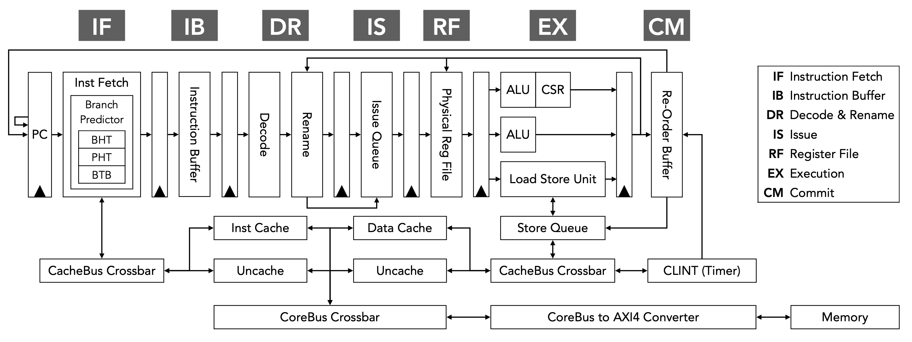
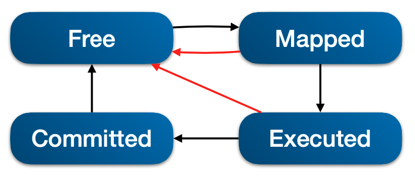
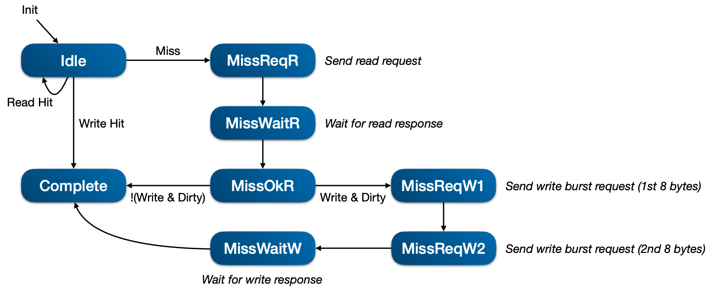
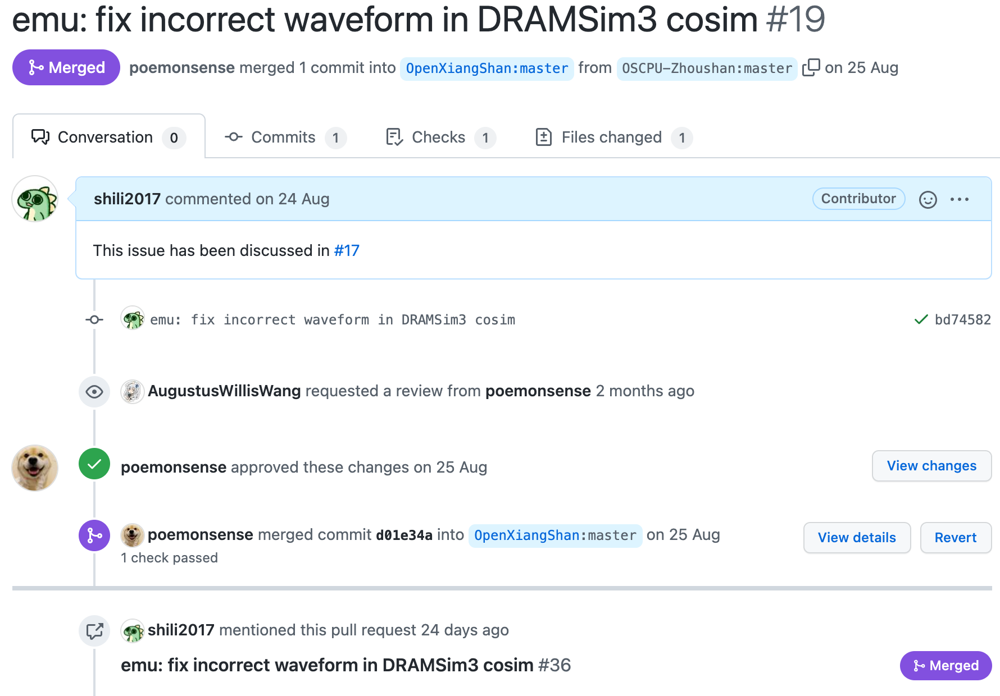

# Open-Source Chip Project by University Project Report 一生一芯项目报告

Li Shi 史历, 20210128

## Who am I? 我是谁？

I'm Li Shi. I graduated from Shanghai Jiao Tong University and obtained the B.S. degree in Electrical & Computer Engineering (ECE) in August 2021. My capstone design project is [RISC-V Processor Design and Optimization](https://github.com/UMJI-VE450-21SU/Ria), and you may find my B.S. thesis [here](https://github.com/UMJI-VE450-21SU/Ria/blob/master/docs/VE450%20Final%20Report.pdf). I will become a graduate student in ECE at Carnegie Mellon University in January 2022.

我是史历，2021年8月毕业于上海交通大学，取得电子与计算机工程专业工学学士学位。我的毕业设计项目是[RISC-V处理器的设计与优化](https://github.com/UMJI-VE450-21SU/Ria)，你可以在[这里](https://github.com/UMJI-VE450-21SU/Ria/blob/master/docs/VE450%20Final%20Report.pdf)阅读我的毕业论文。我将于2022年1月前往卡内基梅隆大学继续深造，攻读电子与计算机工程专业硕士研究生项目。

## Project Overview 项目概览

- Project: Zhoushan (https://github.com/OSCPU-Zhoushan/Zhoushan)

- ISA: RISC-V, RV64I

- Language: Chisel

- Superscalar: 2-way

- Out-of-order: Yes

- Cache: 4 KB Instruction Cache + 4 KB Data Cache

- License: Mulan PSL v2

## Microarchitecture Design 微架构设计

Zhoushan is a superscalar out-of-order core with 7 pipeline stages, which is divided into frontend and backend. The frontend involves a 2-way instruction fetch unit with a 2-level local branch predictor and an instruction buffer, while the backend includes instruction decode & register renaming, issue units, physical register file, execution units, and a re-order buffer.

Zhoushan是一个7级流水线超标量乱序处理器，可分为前端与后端。前端有两路取指单元、两级局部分支预测器，以及一个指令缓冲。后端有指令解码器、寄存器重命名、发射单元、物理寄存器、执行单元和重排序缓冲。

### Instruction Fetch & Branch Prediction 取指与分支预测

The 2-way instruction fetch unit sends request to instruction cache and receives 64 bits, i.e., 2 instructions at a time. Meanwhile, the branch predictor makes prediction in terms of direction and target address. The specific parameters of the branch predictor are listed below.

取指单元负责向指令缓存发送取指请求，并可一次接受64 bits，即2条指令。同时，分支预测会对分支跳转与跳转目标地址做出预测。分支预测器的具体参数如下。

- Branch History Table (BHT): width = 6, size = 64

- Pattern History Table (PHT): width = 8, size = 64

- Branch Target Buffer (BTB): size = 64, 4-way associative, PLRU replacement

We have a one-cycle delay for the branch predictor. In the first clock cycle, it accepts the PC address and we read BHT. At the rising edge of the second clock cycle, we read PHT according to BHT, and data from BTB. If BTB misses, even though we predict to jump according to the result from PHT, we decide not to jump as we don't have the target address.

该分支预测器有一拍的延迟。在第一拍，分支预测器接受PC地址的输入，并读取BHT。在第二拍的时钟上升沿，我们根据BHT的读取结果读取PHT，并读取BTB中的数据。若BTB未命中，即使PHT的读取结果是分支需要跳转，但是由于没有跳转目标地址，我们也将选择不进行跳转。

We can easily switch to GShare predictor in the configurations, but the current predictor gives a higher prediction accuracy. We also have a 16-entry return address stack (RAS), but it still involve some bugs and is not fully implemented and tested, which leads to lower prediction accuracy, so it is not included in the final design.

我们可以在配置文件中很容易切换到GShare分支预测器，但是当前的分支预测器有更高的预测准确度。我们也设计了一个16项的返回地址栈 (RAS)，但仍存在bug，没有充分测试过，会导致预测准确度降低，因此并未加入最终提交的设计之中。

### Instruction Buffer 指令缓冲

The instruction buffer is a circular queue with 8 entries, aiming at decouple frontend and backend. It can accept the input of 2 instructions and output 2 instructions at a time.

指令缓冲是一个容量为8的循环队列，旨在使处理器前后端解耦。指令缓冲可一次输入2条指令，输出2条指令。

### Instruction Decode & Register Renaming 指令解码与寄存器重命名

We have a 2-way instruction decoder to convert RISC-V instructions into micro-ops (uops). The decoding logics are optimized by `ESPRESSO`, introduced in Chisel 3.5 as a new feature.

指令解码单元可同时解码两条指令，将RISC-V指令转换为微指令 (uops)。解码单元的逻辑由`ESPRESSO`进行优化，这是在Chisel 3.5版本引入的新特性。

In Zhoushan, register renaming is based on the unified physical register file (PRF). In this stage, the processor will first allocate free registers, and update the PRF state table. In the PRF state table, each physical register corresponds to a 4-state FSM, as shown in the following figure (Red path represents for PRF state recovery from branch mis-prediction). Meanwhile, remame table records the mapping relationships between physical registers and architectural registers. Fast mis-prediction recovery is supported as spec table can be recovered from arch table in one clock cycle.

Zhoushan采用统一物理寄存器方式进行寄存器重命名。在这一阶段，处理器首先会分配空闲寄存器，并更新PRF状态表。在PRF状态表中，每一个物理寄存器对应一个4状态的有限状态机 （红色路径表示分支预测错误情况下的PRF状态的恢复路径），如下图所示。同时，重命名表记录了物理寄存器与逻辑寄存器之间的映射关系。spec重命名表可以由arch重命名表在一拍内恢复，即支持分支预测错误后的快速恢复。

### Instruction Issue & Register File 指令发射与寄存器堆

We implement distributed issue units, summaried as follows.

我们采用了分布式的发射单元，总结如下。

- Integer Issue Queue: size = 8, 2 in, 2 out, collapsing

- Memory Issue Queue: size = 8, 2 in, 1 out, collapsing

For integer issue queue, as CSR registers are not renamed, we must wait for the execution stage to clear all in-flight instructions before issuing CSR access instructions. For memory issue queue, `store` instructions act as instruction barrier, i.e., `load` instructions between 2 `store` instructions can be issued out-of-order, but `store` instructions must be in-order.

对整数指令发射队列而言，由于CSR寄存器没有重命名，我们必须等待执行单元清空所有未执行完的指令之后，才可以发射CSR相关的指令。对访存指令发射队列而言，`store`指令可以视作指令的barrier，也就是说，两条`store`指令之间的`load`可以乱序发射，但是`store`指令是严格顺序的。

The size of physical register file is 64.

物理寄存器堆大小为64。

### Execution & Commit 执行与提交

Execution stage includes 3 execution pipes as follows.

执行级有如下三条执行管道。

- Pipe 0: 1 ALU + 1 CSR + 1 FENCE

- Pipe 1: 1 ALU

- Pipe 2: 1 LSU

The load-store unit (LSU) is connected to a 4-entry store queue. When a `store` instruction enters LSU, it will be added into the store queue. Once a certain `store` instruction is commited, the store queue will then send the store request to data cache. Unfortunately, it is the bottleneck of performance of this processor. Non-blocking cache and out-of-order memory access are not implemented due to time limitation.

访存单元连接至4项的store队列。当一条`store`指令进入访存单元时，该指令会被添加到store队列的队尾。一旦某条`store`指令被提交，store队列会将队首的指令发送store请求至数据缓存。遗憾的是，访存单元是该处理器的性能瓶颈。由于时间限制，我们并未实现非阻塞缓存与乱序访存。

We implement a 16-entry re-order buffer based on a circular queue. Specifically, it can retire at most 1 `store` instruction at a time, or at most 1 jump instruction at a time. When an external interrupt occurs, it will handle the interrupt immediately, and clear the pipeline.

我们基于循环队列设计了16项重排序缓冲。需要注意的是，一拍内最多只能同时提交一条`store`指令，或者一条跳转指令。当外部中断发生时，重排序缓冲会立刻处理中断，并清空流水线。

### Cache 缓存

Instruction cache and data cache are identical (except the implementation for `fence.i` instruction). Key parameters are listed below.

指令缓存与数据缓存设计完全一致（除了`fence.i`指令的实现）。关键参数如下。

- 4 KB (4x 1 KB synchrounous single-port SRAMS)

- 16-byte (128-bit) cacheline

- Write allocate + write back policy

- 4-way associative

- PLRU replacement

For `fence.i` instruction, the instruction cache will clear the valid field in each cacheline, while the data cache will first write all the dirty cacheline back to memory and then clear the valid field in each cacheline.

对`fence.i`指令，指令缓存会直接将所有缓存行中的valid位清空，而数据缓存会首先将所有标记为dirty的缓存行写回内存，然后将所有缓存行中的valid位清空。

For regular cache access, we implement a 9-state FSM, shown in the following figure. For `fence.i` instruction in data cache, we implement a 6-state FSM, but skipped in this report.

对普通的缓存访问，我们实现了一个9状态的有限状态机，如下图所示。对`fence.i`指令在数据缓存中的实现，我们实现了一个6状态的有限状态机，但由于篇幅所限在此跳过。

## Fun Facts 一些有趣的事情

- First time to learn so much stuff (AM, difftest, NEMU, AXI, etc.) in such a short period

- 第一次在如此短的时间内学这么多东西（AM、difftest、NEMU、AXI协议等）

- First time to implement a complete CPU design independently

- 第一次独立实现一个完整的CPU设计

- First time to raise an issue in GitHub

- 第一次在GitHub讨论区提问题

- First time to make a pull request (see the following screenshot)

- 第一次发起PR （看下面的截图）

- First time to actually use `git` for project management

- 第一次真正意义上使用`git`进行项目管理

- ~~Recruit 8 team members but they all quit~~

- ~~前前后后招了8个队友但是全部跑路了~~

## Future Plans 未来计划

### Short-term 短期

- Improve existing out-of-order design, especially the load-store unit (pipeline, load and store queue, non-blocking cache, MSHR...)

- 继续改进现有的乱序设计，尤其是访存单元（流水线，访存队列，非阻塞缓存，MSHR……）

- Optimize the critical path and improve core frequency

- 优化关键路径，提升核心频率

### Long-term 长期

- Learn operating systems

- 学习操作系统

  - [rCore](https://rcore-os.github.io/rCore-Tutorial-Book-v3/index.html) from THU

  - 清华大学 [rCore](https://rcore-os.github.io/rCore-Tutorial-Book-v3/index.html)

  - Run rCore on open-source RV64GC cores (e.g., rocket)

  - 在开源的RV64GC处理器（如rocket）上运行rCore

- Implement [`rcc`](https://github.com/shili2017/rcc) (rCore in C)

- 实现 [`rcc`](https://github.com/shili2017/rcc) （用C实现rCore）

- Support RV64IMA extension on Zhoushan, add S & U privilege mode, add MMU (implement PTW, TLB...)

- 在Zhoushan上进一步支持RV64IMA指令集扩展，添加S与U特权级，添加内存管理单元（实现PTW、TLB等）

- Transplant Unix-like OS (e.g., rCore, Linux kernel) to Zhoushan core

- 将Unix-like操作系统（如rCore、Linux内核）移植到Zhoushan上

## Reference & Dependency 参考设计与依赖项目

- `MicroOp` definition and overall pipeline design are modified from [Ria](https://github.com/UMJI-VE450-21SU/Ria) project (my capstone design project)

- `MicroOp` 定义与总体的流水线设计修改自[Ria](https://github.com/UMJI-VE450-21SU/Ria)项目（我的本科毕业设计项目）

- `RegMap`, `Utils`, etc., refer to [NutShell](https://github.com/OSCPU/NutShell) core

- `RegMap`, `Utils`等模块的设计参考了[果壳](https://github.com/OSCPU/NutShell)

- Circular queue design partially refers to [Xiangshan](https://github.com/OpenXiangShan/XiangShan) core

- 循环队列的设计部分参考了[香山](https://github.com/OpenXiangShan/XiangShan)

- Zhoushan core depends on other open-source projects or software, including

- Zhoushan依赖于其他开源项目或软件，包括

  - [Verilator](https://verilator.org)

  - [Difftest](https://github.com/OpenXiangShan/difftest)

  - [DRAMsim3](https://github.com/OpenXiangShan/DRAMsim3)

  - [Abstract Machine](https://github.com/NJU-ProjectN/abstract-machine)

  - [NEMU](https://github.com/OpenXiangShan/NEMU)

  - [ESPRESSO](https://github.com/classabbyamp/espresso-logic)

## Acknowledgements 致谢

感谢第三期一生一芯项目团队全体成员。我所在的前端助教团队有很多非常幽默搞笑的小伙伴，在上海处理器中心工作的每一天都非常有趣，大家每天一起聚在一起讨论各种技术问题，我从中也受益匪浅。SoC与后端助教团队同样非常给力，他们的专业技能保证了这一期项目的顺利进行，CI/CD流程能够及时反馈我提交的设计中存在的各种问题。

感谢中科院计算所与鹏城实验室的解壁伟老师和包云岗老师，他们负责这一期一生一芯项目。项目进行过程中我也定期向解壁伟老师汇报，他给了我非常多项目上的指导与建议。

感谢一路以来一直帮助过我的各位师长与好友。在我本科期间，我曾参与上海交通大学的钱炜慷老师的本科生科研项目，我第一次正式接触数字电路设计与EDA工具，项目期间他给予了我非常大的帮助。大四在Apple实习时，偶然接触到计算机体系结构这一学科，负责我实习的工程师Leo Lu经常和我一起讨论相关的问题，鼓励我在这一领域继续深入学习。在交大的最后一学期，很幸运遇到了四位密院最厉害的队友，刘之远、孙逸秋、袁意超和时尖，我和袁、时两位同学曾一大早从交大赶到上科大参加RISC-V 2021中国峰会，第一次见到香山项目，虽然看不懂但是大受震撼，当然毕业前的最后一周，大家一起通宵赶毕业论文的日子也同样让我终生难忘。

感谢我的父母，他们自始至终无条件地支持我选择电子与计算机工程专业，支持我参加一生一芯项目，支持我出国继续深造。
